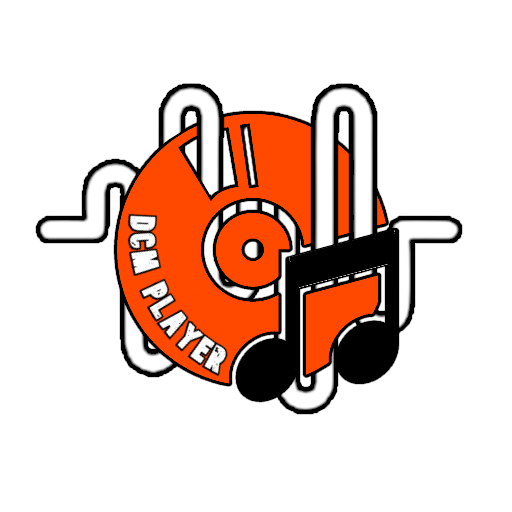

# DCM Player
Hello,
Welcome to DCM Player.

## Logo

DCM Player is a music player webapp that we provide to play music lyrics stored online.

With this application, we hope to be able to help musicians everywhere. Because this is the place to share your musical experiences.

>Regarding the copyright of the songs uploaded here, we are only a party that provides upload services and lyric music players, in other words, the music uploaded by users does not mean that the song belongs to the user! and if the user claims verbally in the input column that he is the owner of the song when in fact he is not, then we will take firm action by deleting the song and blocking the user. The information we record about the user will be submitted to the original song owner. Read more [Privacy Policy](https://darkcluemusic.github.io/privacy-policy/).

## Home
 

This is a collection of songs that you can choose to listen to. We shuffle all the songs here so you can see other songs and not look boring.

## About
 

The information center that we provide for how to use the DCM Player application. Contact us if you are still confused at [Email](mailto:darkcluemusic@gmail.com) or [@dcmplayer](https://t.me/dcmplayer).

## Setting
 

You can arrange or decorate the display according to what is provided, just pretend you are in your own home and manage your posts.

## Upload
 

Make sure everything is filled in correctly and to create a text/json lyrics file you can go to [here](https://darkcluemusic.github.io/lyrics-maker/).

# Download APK
- [DCM Player](https://github.com/darkcluemusic/dcmplayer/releases/download/dcm_player_v1_apk/app-debug.apk)
